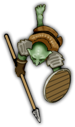

# How it works
## Physics
- Spear conected with PinJoint2D to Dwarf [RigidBody2D](https://docs.godotengine.org/en/stable/classes/class_rigidbody2d.html) Node (this is for physical connection)
- Spear also connected to "hand"-bones with [RemoteTransform2D](https://docs.godotengine.org/en/stable/classes/class_remotetransform2d.html) Nodes
- Inverse Kinematic from [u/Ephemeralen](https://www.reddit.com/user/Ephemeralen) to make arms follow spear and hands.

## Sprite deformation
Followed [this tutorial](https://docs.godotengine.org/en/stable/tutorials/animation/2d_skeletons.html)

# Assets
## Dwarf Image
[Dwarf Image Source](https://marketplace.roll20.net/browse/set/559/15-dwarves)

## Goblin Image
[Goblin Image Source](https://marketplace.roll20.net/browse/set/544/02-goblins-and-kobolds)

## Combat map
[Combat map Source](https://www.pinterest.de/pin/308215168254181967)

